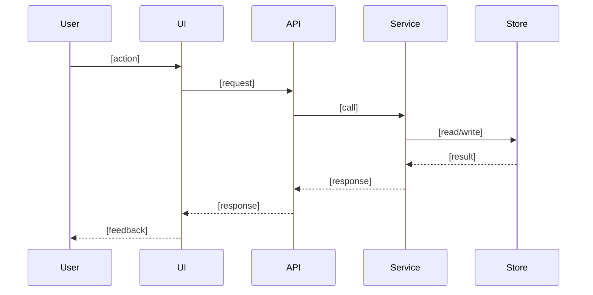

# Sequence — [feature]
> Optional design attachment. Generate only when PID detects multi-module coordination, async work, third-party integration, permission chains, multi-state flow, or front/back-end multi-step interaction.

版本：v1.0 | 日期：[日期] | 关联 PID：.pact/specs/[feature]-pid.md

## 触发原因
[为什么当前功能需要时序图；引用 PID 的触发项]

## 参与者
- User
- UI
- API
- Service
- Store

## 时序图

## 关键状态变化
- [状态 A] -> [状态 B]

## 失败路径
| 场景 | 失败点 | 系统响应 | 用户反馈 |
|------|--------|----------|----------|
| [场景] | [位置] | [响应] | [反馈] |

## 验收映射
- FC 候选：[可转为 contract FC 的调用顺序或状态变化]
- NF 候选：[可转为 contract NF 的可靠性 / 反馈要求]
- 人工验收：[无法自动化验证的项目]
