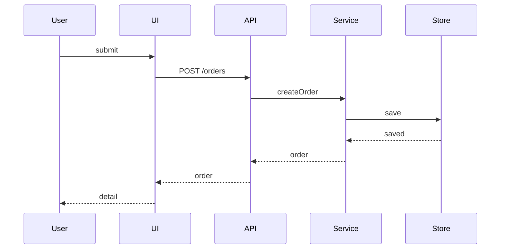

# Sequence — create-order

## 触发原因
前端、API、服务和存储需要确认调用顺序。

## 参与者
- User
- UI
- API
- Service
- Store

## 时序图

## 关键状态变化
- draft -> created

## 失败路径
| 场景 | 失败点 | 系统响应 | 用户反馈 |
|------|--------|----------|----------|
| 保存失败 | Store | error | 留在表单 |

## 验收映射
- FC 候选：调用 save 后返回 order。
- NF 候选：保存失败返回错误。
- 人工验收：无
