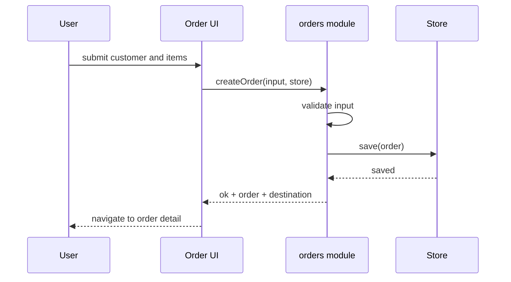

# Sequence — create-order

## 触发原因
创建订单需要确认用户、订单逻辑和 store 的调用顺序，以及保存失败时的返回路径。

## 参与者
- User
- Order UI
- orders module
- Store

## 时序图

## 关键状态变化
- order:draft -> order:created

## 失败路径
| 场景 | 失败点 | 系统响应 | 用户反馈 |
|------|--------|----------|----------|
| 缺少客户名 | validate input | 不调用 store.save | 留在 order-form，显示 `Customer name is required` |
| 缺少商品 | validate input | 不调用 store.save | 留在 order-form，显示 `At least one item is required` |
| 保存失败 | Store | 返回错误 | 留在 order-form，显示 `Could not save order` |

## 验收映射
- FC 候选：有效输入调用 save 并返回 created order。
- FC 候选：校验失败不调用 save。
- NF 候选：保存失败留在表单。
- 人工验收：无
